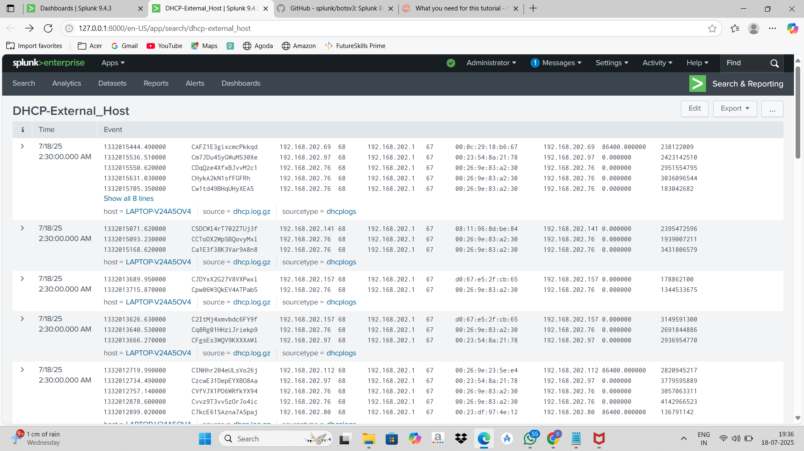

## DHCP Log Ingestion in Splunk

The DHCP logs were successfully ingested and indexed in Splunk for analysis.

## DHCP Event Analysis

Raw DHCP events were analyzed to identify IP allocation activity and client behavior.

-Copy.png)

## SPL Query for Suspicious Activity

Example query used to detect hosts generating high DHCP request counts.

.png)

## Visualization of DHCP Request Sources

A visualization showing the top IP addresses generating DHCP requests.

.png)
